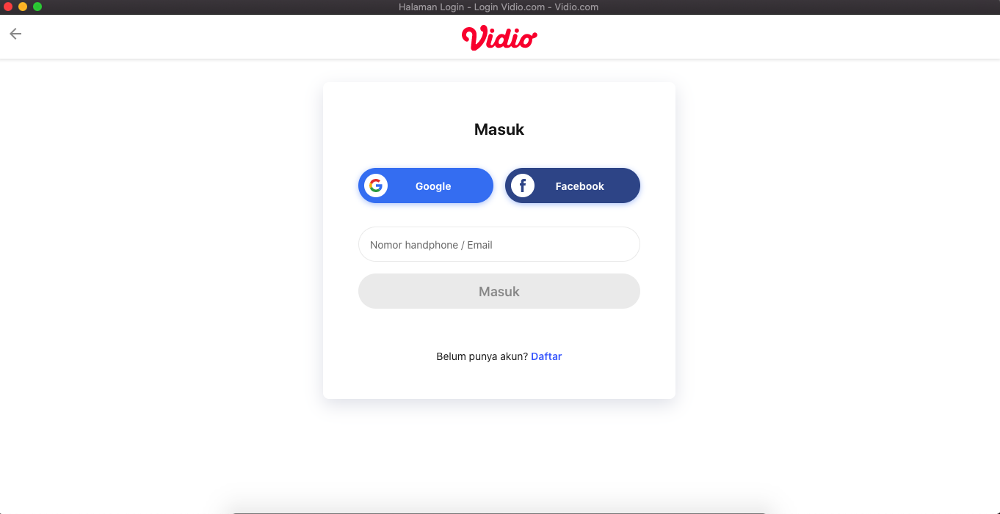

# [Unofficial] Vidio Desktop App




## Installation For Your Desktop

Download our latest release and you're off to the races!

| Windows | macOS | GNU/Linux (64-bit only) |
| -- | -- | -- |
| [Download](#) | [Download](#) | [Download](#) |


## Development Guide

If you want to hack on this project, here is how you do it.
<details><summary>Show instructions</summary>

### Setup

First, clone the project:

```bash
git clone https://github.com/tommy-maulana/Vidio-Desktop.git

cd Vidio-Desktop
```

Install dependencies for both the CLI and the Electron app:

```bash
# Under Linux and macOS:
npm run dev-up

# Under Windows:
npm run dev-up-win
```

Then, install Nativefier globally with ```npm install -g nativefier```

and then run this project:

```bash
nativefier --name 'Vidio' 'vidio.com'
```
</details>

## License

[MIT](LICENSE.md)
